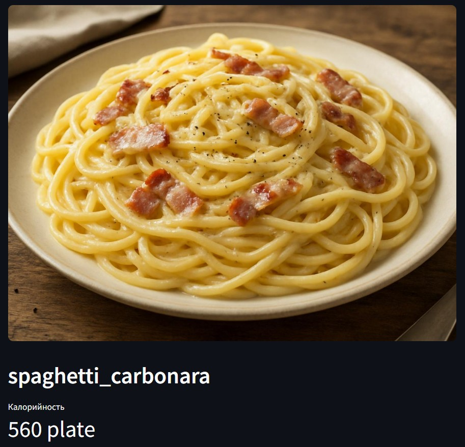
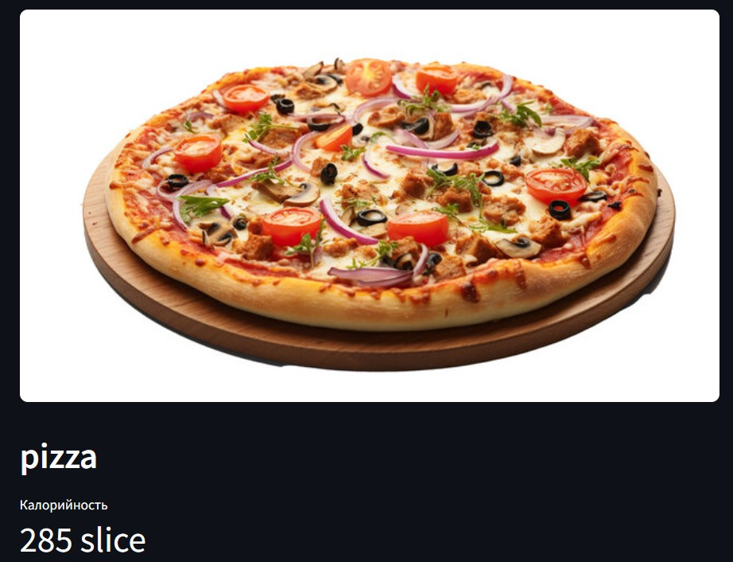

# AI Calorie Counter

Комплект из модели компьютерного зрения, FastAPI‑бекенда и Streamlit‑интерфейса, который определяет тип блюда на фотографии и показывает приблизительную калорийность на основании словаря. Модель обучается на датасете Food‑101 и сохраняется в каталоге `models/`.

## Архитектура проекта
- **Модель**: EfficientNet‑B0 с предобученными весами ImageNet. Классификатор дообучается на 101 классе Food‑101, веса сохраняются в `models/food_classifier.pth`, а соответствие `класс → индекс` — в `models/classes.json`.
- **Backend (`src/backend`)**: FastAPI‑приложение (`main.py`) с единой точкой `/predict`. Файл `inference.py` загружает веса, выполняет предобработку изображений, инференс и подтягивает данные о калориях из `src/backend/calorie_lookup.json`.
- **Frontend (`src/frontend`)**: Streamlit‑приложение (`app.py`), позволяющее загрузить файл или снять кадр с веб‑камеры и визуализировать ответ сервера.
- **Обучение (`src/train_model.py`)**: скрипт, который скачивает Food‑101, обучает модель и формирует артефакты.

```
cv-project/
├── data/                # сюда скачивается Food-101 (можно изменить через FOOD101_DATA)
├── models/              # веса food_classifier.pth и classes.json
├── src/
│   ├── backend/
│   │   ├── main.py
│   │   ├── inference.py
│   │   └── calorie_lookup.json
│   ├── frontend/
│   │   └── app.py
│   └── train_model.py
├── docker-compose.yml
├── Dockerfile.backend
├── Dockerfile.frontend
└── requirements_training.txt
```

## Быстрый старт (Docker)
1. Убедитесь, что `models/food_classifier.pth` и `models/classes.json` существуют (по умолчанию после обучения лежат именно здесь).
2. Запустите оба сервиса:  
   ```bash
   docker-compose up --build
   ```
3. Перейдите в браузере на http://localhost:8501 — это Streamlit. Он обращается к бекенду по сети `docker-compose` (http://backend:8000).
4. Чтобы остановить контейнеры, нажмите `Ctrl+C` в терминале с docker-compose или выполните `docker-compose down`.

## Локальный запуск без Docker
1. **Создайте и активируйте виртуальное окружение** (пример для PowerShell):  
   ```powershell
   python -m venv .venv
   .\.venv\Scripts\Activate.ps1
   ```
2. **Установите зависимости**:
   ```powershell
   pip install -r requirements_training.txt
   pip install fastapi uvicorn[standard] streamlit requests python-multipart
   ```
3. **Стартуйте API** (из корня проекта):  
   ```powershell
   uvicorn src.backend.main:app --host 0.0.0.0 --port 8000
   ```
   Документация будет доступна на http://localhost:8000/docs.
4. **Стартуйте фронтенд** в другой консоли:  
   ```powershell
   cd src\frontend
   streamlit run app.py
   ```
   При необходимости можно переопределить адрес API переменной `BACKEND_URL`.

## API
- `GET /` — health-check (`{"status": "API is running"}`).
- `POST /predict` — принимает изображение (поле `file` в multipart/form-data) и возвращает JSON:
  ```json
  {
    "food_name": "club_sandwich",
    "calories": {"value": 340, "unit": "kcal"},
    "confidence": 0.79
  }
  ```

Пример запроса (PowerShell):
```powershell
Invoke-WebRequest `
  -Uri http://localhost:8000/predict `
  -Method Post `
  -Form @{ file = Get-Item .\sample.jpg }
```

## Работа фронтенда
- Загрузка файла (`st.file_uploader`) или снимка с веб‑камеры (`st.camera_input`).
- Отправка изображения на эндпоинт `/predict` и отображение ответа.
- Настройки подключения: переменная `BACKEND_URL` (по умолчанию `http://localhost:8000`). При запуске в Docker подставляется `http://backend:8000`.

## Обучение модели
1. Убедитесь, что хватает дискового места (Food‑101 ≈ 5 ГБ) и интернет‑доступа.
2. Активируйте окружение и установите зависимости из `requirements_training.txt`.
3. Запустите скрипт:
   ```bash
   python src/train_model.py
   ```
   Доступные переменные окружения:
   - `FOOD101_DATA` — путь к каталогу с датасетом (по умолчанию `data/`).
   - `EPOCHS` — число эпох (по умолчанию 3).
4. После завершения появятся:
   - `models/food_classifier.pth` — веса EfficientNet‑B0.
   - `models/classes.json` — отображение `класс: индекс`, используемое при инференсе.

## Калибровка калорий
Файл `src/backend/calorie_lookup.json` хранит сведения вида:
```json
{
  "club_sandwich": {"calories": 340, "unit": "kcal"},
  "apple_pie": {"calories": 237, "unit": "kcal"}
}
```
Добавьте или обновите записи, чтобы выравнивать значения для нужных блюд. Ключ должен совпадать с именем класса, которое выдаёт модель (`food_name`).

## Результаты

### Пример 1


### Пример 2

